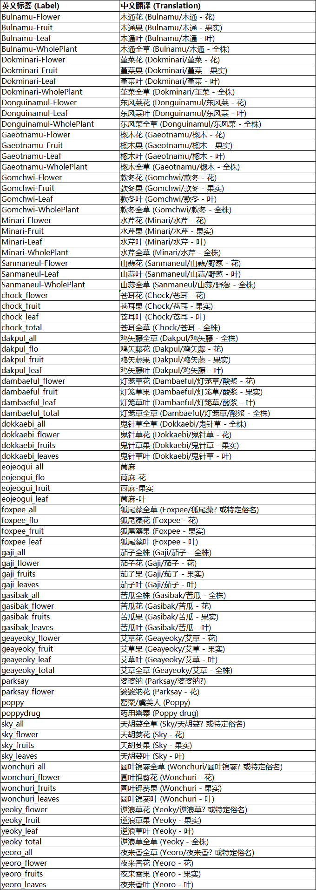
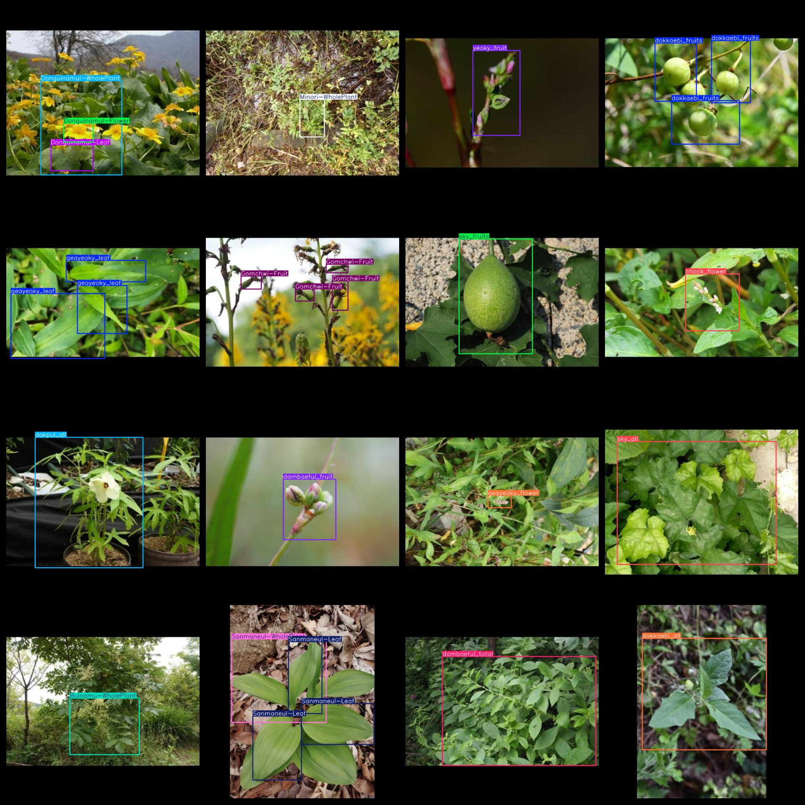
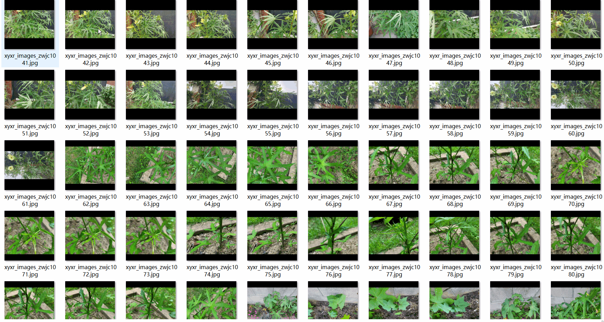

# 82 typesHerb and Plant Detection Dataset 6667 imagesVOC+YOLO format

The 82 herbal and plant detection dataset consists of 6667 VOC+YOLO format images.

Dataset format: Pascal VOC format + YOLO format (the txt file does not contain the split path, it only contains jpg images and corresponding VOC format xml files and yolo format txt files)

Number of image files: 6667

Number of xml files: 6,667

Number of txt files: 6667

Label count: 82

The Github repository is: datasets_sl

["Bulnamu-Flower","Bulnamu-Fruit","Bulnamu-Leaf","Bulnamu-WholePlant","Dokminari-Flower","Dokminari-Fruit","Dokminari-Leaf","Dokminari-WholePlant","Donguinamul-Flower","Donguinamul-Leaf","Donguinamul-WholePlant","Gaeotnamu-Flower","Gaeotnamu-Fruit","Gaeotnamu-Leaf","Gaeotnamu-WholePlant","Gomchwi-Flower","Gomchwi-Fruit","Gomchwi-Leaf","Gomchwi-WholePlant","Minari-Flower","Minari-Fruit","Minari-Leaf","Minari-WholePlant","Sanmaneul-Flower","Sanmaneul-Leaf","Sanmaneul-WholePlant","chock_flower","chock_fruit","chock_leaf","chock_total","dakpul_all","dakpul_flo","dakpul_fruit","dakpul_leaf","dambaeful_flower","dambaeful_fruit","dambaeful_leaf","dambaeful_total","dokkaebi_all","dokkaebi_flower","dokkaebi_fruits","dokkaebi_leaves","eojeogui_all","eojeogui_flo","eojeogui_fruit","eojeogui_leaf","foxpee_all","foxpee_flo","foxpee_fruit","foxpee_leaf","gaji_all","gaji_flower","gaji_fruits","gaji_leaves","gasibak_all","gasibak_flower","gasibak_fruits","gasibak_leaves","geayeoky_flower","geayeoky_fruit","geayeoky_leaf","geayeoky_total","parksay","parksay_flower","poppy","poppydrug","sky_all","sky_flower","sky_fruits","sky_leaves","wonchuri_all","wonchuri_flower","wonchuri_fruits","wonchuri_leaves","yeoky_flower","yeoky_fruit","yeoky_leaf","yeoky_total","yeoro_all","yeoro_flower","yeoro_fruits","yeoro_leaves"]

Number of boxes labeled in each category:

Bulnamu-Flower Frame Number = 201

Bulnamu-Fruit frame count = 433

Bulnamu-Leaf frame count = 447

Bulnamu-WholePlant frame count = 83

The number of Dokminari-Flower frames = 200

Dokminari-Fruit frame count = 233

The number of Dokminari-Leaf frames is 202.

Dokminari-WholePlant frame count = 88

Donguinamul-Flower Frames = 124

Donguinamul-Leaf frame count = 326

Donguinamul-WholePlant frame count = 192

Gaeotnamu-Flower Frame Count = 24

Gaeotnamu-Fruit frame count = 230

Gaeotnamu-Leaf frame count = 431

Gaeotnamu-WholePlant frame number = 84

Gompchwi-Flower Frames = 200

The number of Gomchwi-Fruit frames is 159.

Gomchwi-Leaf frame count = 309

Gomchwi-WholePlant frame count = 84

Minari-Flower Frames = 199

Minari-Fruit frame count = 227

Minari-Leaf Frame Count = 704

Minari-WholePlant Frame Count = 101

Sanmaneul-Flower Frame Number = 81

Sanmaneul-Leaf frame count = 696

Sanmaneul-WholePlant frame count = 170

Chock flower frame count = 128

Chock fruit frame count = 68

Chock leaf frame count = 599

The total number of frames in the "chock_total" box is 100.

The number of boxes in the dakpul_all frame is 197.

The number of frames in the DAKPUFLO box = 155

"Dakpul_fruit" is a Chinese word that translates to "Dakpur fruit" in English. The number "146" does not have any specific meaning in the context of this word.

Dakpul Leaf Frames = 296

The number of frames in the dambaeful_flower frame = 212

The number of frames in the "dambaeful_fruit" frame is 537.

The number of dambaeful_leaf frames is 253.

Dambaeful total frame count = 100

dokkaebi_all frame count = 93

The number of frames in dokkaebi_flower = 150.

The number of dokkaebi_fruits boxes is 133.

The number of dokkaebi_leaves boxes is 103.

The number of eojeogui_all boxes is 92.

Eojeogui_flo frame number = 126

The number of frames in the eojeogui_fruit box is 360.

The number of "eojeogui_leaf" boxes is 319.

The number of frames in the FoxPee_all box is 136.

The number of frames in the FoxPeeFlo frame = 173

The number of foxpee_fruit boxes is 271.

The number of foxpee_leaf frames is 693.

gaji_all frame count = 93

The number of gaji_flower boxes is 106.

The number of fruits in the 'gaji_fruits' box is 115.

The number of gaji leaves is 120.

Gasibak_all box = 100

The number of gasibak_flower boxes is 131.

The number of gasibak_fruits frames is 100.

The number of gasibak_leaves is 180.

geayeoky_flower frame count = 182

"geayeoky_fruit" is a Korean word that translates to "green apple". The number 160 refers to the total number of frames in this video or image, which is 160.

The number of geayeoky_leaf rectangles is 111.

The total number of boxes in the "geayeoky_total" box is 100.

ParkSay frame count = 87

parksay_flower frame count = 23

Poppy box count = 19

The number of poppydrugs is 16.

The number of sky_all boxes is 98.

The number of sky_flower frames is 106.

The number of sky fruits in the box is 114.

sky_leaves frame count = 127

wonchuri_all frame count = 17

wonchuri_flower frame count = 13

wonchuri_fruits frame count = 10

Number of Window Curtain Leaves = 40

The number of Yeoky Flowers is 149.

yeoky_fruit frame count = 89

yeoky_leaf frame count = 251

The total number of frames in the 'yeoky_total' frame = 84

The number of frames in the YorO_all box is 11.

The number of Yeoro Flowers is 12.

The number of yeoro_fruits boxes is 5.

The number of yeoro_leaves frames is 19.

Total Frames: 14456

Number of images per category:

Bulnamu-Flower's Claim to Pictures = 100

Bulnamu-Fruit occupies a total of 100 pictures.

Bulnamu-Leaf's Photograph Count = 99

Bulnamu-WholePlant occupies 83 images.

Dokminari-Flower occupies 100 images.

Dokminari-Fruit holds 100 images.

Dokminari-Leaf occupies 101 pictures.

Dokminari-WholePlant occupies 88 images.

Donguinamul-Flower occupies a total of 79 images.

Donguinamul-Leaf has 143 images.

Donguinamul-WholePlant occupies 190 pictures.

Gaeotnamu-Flower occupies = 12

Gaeotnamu-Fruit occupies a total of 100 pictures.

Gaeotnamu-Leaf has 103 images.

Gaeotnamu-WholePlant occupies 84 photos

Gomachwi-Flower owns 100 images.

Gomechwi-Fruit holds 62 images.

Gomachwi-Leaf occupies = 100

Gomechwi-WholePlant occupies 84 images.

Minari-Flower's possession of image counts = 100

Minari-Fruit's Ownership of Images = 100

Minari-Leaf's occupancy rate for images = 100

Minari-WholePlant occupies 100 images.

Sanmaneul-Flower has 28 pictures.

Sanmaneul-Leaf's occupancy of images = 187

Sanmaneul-WholePlant occupies a total of 167 images.

Chock_flower occupies 100 images.

Chock_fruit occupies 58 images.

Chock_leaf occupies the number of pictures = 100

Chock_total occupied by the number of pictures = 100

Dakpul_all occupies 100 images.

Dakpul_Flo's possession of images = 100

Dakpul_fruit has 100 pictures.

Dakpul Leaf's occupancy of images = 100

dambaeful_flower has 100 images.

dambaeful_fruit has 113 pictures

dambaeful_leaf's image count = 100

dambaeful_total_photos_count = 100

Dokkaebi_all occupies 93 images.

Dokkakebi_Flower_Occupy_Images = 100

The number of pictures owned by dokkaebi_fruits is 100.

Dokkaebi_leaves_occupy_images = 100

The number of images owned by eojeogui_all is 85.

The number of images owned by EOJEOGUI_FLO = 100

EOJEOGUI_FRUIT occupies = 100

The number of photos owned by Eojeogui Leaf = 100

Foxpee_all_has_84

FoxPeep Flot occupies the number of images = 100

The number of pictures owned by FoxPeep_fruit is 100.

FoxPeep_Leaf has 100 images.

Gaji_All_Occupy_Image_Count = 93

Gaji_flower_occupy_image_count = 100

The number of images owned by "gaji_fruits" is 100.

Gaji_leaves has 100 pictures.

Gasibak_all occupies 99 images.

Gasibak_flower_occupy_photo_count = 98

Gasibak_fruits have 100 pictures.

Gasibak_leaves have 100 pictures.

Geayeoky_flower has 100 images.

The number of images owned by Geayeoky_fruit is 100.

Geayeoky_leaf's possession of images = 100

geayeoky_total = 100

ParkSay's occupancy count = 40

ParkSay Flower occupies 4 images.

Poppy's possession count = 8

Poppydrug's share of the images = 11

Sky_all_occupied_image_count = 98

Sky_flower's number of pictures = 100

Sky_fruits has 100 images.

Sky_Leaves has 100 images.

Wonchuri_all has 15 images.

Wonchuri_flower's image count = 13

The number of images owned by wonchuri_fruits is 5.

Wonchuri_leaves have 38 pictures.

Yeok-yeo Flower's possession of images = 100

Yeoky_fruit owns 85 pictures.

Yeok-yong leaf's ownership count = 100

The total number of images owned by yekyi_total = 84

Yeoro_all_occupy_image_count = 11

Yeoro_Flower_Occupy_Images_Count = 11

Yeorro_fruits_have_5_images

Yeorō leaves have 13 pictures.

Image resolution: 640x640

Use the labeling tool: labelImg

Dataset Augmentation: Yes

Rules for annotation: Draw a rectangle around the category.

Important note: The dataset does not have been divided into training, validation, and testing sets.

Special Disclaimer: This dataset does not guarantee the accuracy of the trained models or weight files.

Annotation and image details are as follows:

## Images

---

Here is a pay link on Stripe (https://buy.stripe.com/3cs8yP7sY87d0vu9AB). Please contact me lonlonago@foxmail.com after funding $89, and I will send you a complete data files, thank you!

